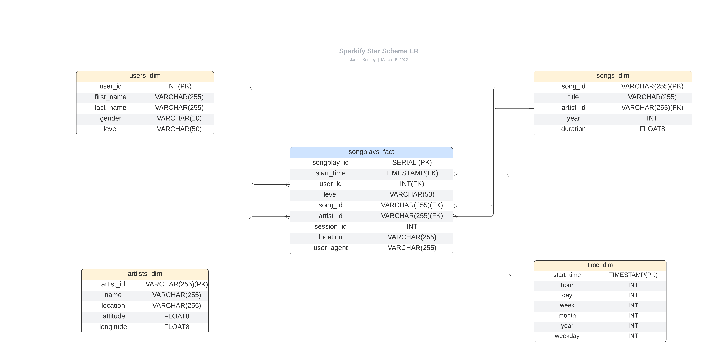

# Sparkify Pipeline for Data Engineering Summary

Sparkify is psuedo a music streaming app that allows users to sign up and stream music. Currently, Sparkify has limited analytics capabiity and needs to find a way to gather and query data to gain valuable insights from their users. Sparkify's data resides in a directory of JSON logs that captures user data and all pertinent metadata and will need to be modeled into a star schema that uses an ETL process to pull data from the JSON directory to a Postgres database. The process is meant to somewhat mimick pulling data from an API into a database.

The star schema will allow for a digestable format that users of the data can understand and query without having to complicate queries with multiple joins over a series of tables. Additionally, using an ETL process from JSON to Postgres will provide a a set of relational tables within a relational database which makes access for analytics much easier. Below is a short description and visual of the model. 

## Overview

The star schema uses a fact table for songplays and four dimension tables (users, songs, artists, time). The DROP, CREATE, INSERT, and SELECT queries are defined in sql_queries.py, these queries are responsible for the Data Defintion Language of the database. The create_tables.py uses functions create_database, drop_tables, and create_tables to create the database sparkifydb and the required tables.

The ETL process (Extract, transform, load) is composed of the python commands located in the etl.py file. These populate the songs and artists tables with data pulled from the JSON song files, data/song_data which creates the data pipeline that will continously stream from the app into the Postgres database. Processed data derived from the JSON log files, data/log_data, is used to populate time and users tables. For data users such as BI analysts or Data Scientist, they now have easy access to a realational model that allows for easy queries using SELECT, FROM, WHERE.

## Star Schema Design

 

## Methodology

The pipleine process runs in the following way:
Note:  To execute scripts: python <scriptname>

  1. create_tables.py (This drops is exists and creates new tables). 
  2. etl.py is run to extract the data from JSON files and load into the new tables.
  3. test.ipynb runs checks on the DDL and output of the queries by running multiple checks. 

## Testing The Model

To safeguard against errors, test.ipny uses mutiple checks for constraints, common errors, datatype and conflicts. Should any errors occur, a warnign message appears below the cell to inform where the error is located. 

